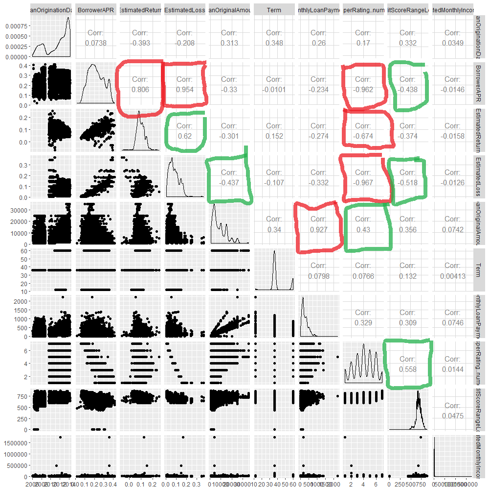

EDA Prosper Loan Data Analyzed by Costa Stamatinos
==================================================

The dataset I am going to explore is the Prosper Loan Data provided for 
the course. The data has 113937 observations(loans), with 81 variables(loan 
number, rate, etc). While most of the data is numerical, 15 variables out of 
the 81 are vectors(non&dash;numerical). The most interesting variables at the 
start are concerned with the amount of money loaned, and the rates for repaying
it. A sample was created for this analysis of 10000 random loans.

```{r echo=FALSE, message=FALSE, warning=FALSE, Load}
#Loading packages used
library(ggplot2)
library(dplyr)
library(gridExtra)
library(reshape2)
library(tidyr)
library(GGally)
library(scales)
library(RColorBrewer)
library(xlsx)
library(ggthemes)
library(stringr)

#Read csv in to data frame
ldf <- read.csv("prosperLoanData.csv", na.strings=c("", "NA"), )

#Change dates to date format
ldf$LoanOriginationDate <- as.Date(ldf$LoanOriginationDate,
                                        format = "%Y-%m-%d %H:%M:%S")
ldf$ListingCreationDate <- as.Date(ldf$ListingCreationDate,
                                        format = "%Y-%m-%d %H:%M:%S")
ldf$ClosedDate <- as.Date(ldf$ClosedDate,
                               format = "%Y-%m-%d %H:%M:%S")
ldf$FirstRecordedCreditLine <- as.Date(ldf$FirstRecordedCreditLine,
                               format = "%Y-%m-%d %H:%M:%S")
ldf$DateCreditPulled <- as.Date(ldf$DateCreditPulled,
                               format = "%Y-%m-%d %H:%M:%S")

#Create sample for analysis
set.seed(1515)
samp_ldf <- ldf[sample(1:length(ldf$Term), 10000), ]
```

#### Summary of the Sample

The factored data is discrete and is plotted using bar plots and columns. The 
numerical data can be analyzed further with built in functions and histograms.
I started by looking through the data and looking at some summaries. After 
exploring, I found that some of the variables were components of others. The 
<a href="https://www.google.com/url?q=https://docs.google.com/spreadsheets/d/1gDyi_L4UvIrLTEC6Wri5nbaMmkGmLQBk-Yx3z0XDEtI/edit?usp%3Dsharing&sa=D&ust=1515110277680000&usg=AFQjCNFhw421fbcJIWcL7z8kFO8b_Vz2cQ">variable definitions</a> were handy in picking
what I wanted to look at. I wanted to further explore the rates and amounts of 
the loans as well as the loss or gain of the lender. Here are the variables
chosen and a summary of each.

```{r echo=FALSE, message=FALSE, warning=FALSE, Summary}
#Summary of first nine columns
sumlist <- c("LoanNumber", "LoanOriginationDate", "LoanOriginalAmount", "StatedMonthlyIncome", "MonthlyLoanPayment", "BorrowerAPR", "CreditGrade",
"Term", "EstimatedLoss", "EstimatedReturn", "ProsperRating..numeric.",
"BorrowerState", "CreditScoreRangeLower", "Occupation", "IncomeRange")
sumlist
```

```{r echo=FALSE, message=FALSE, warning=FALSE}
summary(samp_ldf[sumlist])
```

A few things of note from looking at the summaries. Credit grade has the 
highest number of missing data points(NA). Estimated loss, estimated return 
and prosper score each have over a quarter missing. The loan data starts in 
2006 through 2014, but most were after 2009. The max amount loaned was 
&dollar;35000. We can infer from that that these were not mortgage loans. 
Lastly of interest is the maximum stated income of &dollar;1,750,003 a month! 
This is most likely a mistake or an outlier.  

## Univariate Plots Section

Single variable plots of vectors. I started with the non&dash;numerical data. 
Any observations are at the end of the section.

#### Non&dash;Numerical Data

Credit grade variable definition: The Credit rating that was assigned at the 
time the listing went live. Applicable for listings pre&dash;2009 period and 
will only be populated for those listings.

```{r echo=FALSE, message=FALSE, warning=FALSE, Non-Numerical-Data}
#Plot of credit grade and combined with loaner data
cglimits <- c("AA", "A", "B", "C", "D", "E", "HR", "NC")

ggplot(data = samp_ldf, aes(CreditGrade)) +
  geom_bar(na.rm = T) +
  scale_x_discrete(limits = cglimits)
```

Borrower state variable definition: The two letter abbreviation of the state of 
the address of the borrower at the time the Listing was created.

```{r echo=FALSE, message=FALSE, warning=FALSE}
#Create a sorted data frame of states
top_states <- data.frame(sort(table(samp_ldf$BorrowerState), , decreasing = T))

#Plot top sorted states
ggplot(data = subset(top_states, Freq > 262), aes(Var1, Freq)) +
  geom_col() +
  xlab("States")
```

Occupation variable definition: The Occupation selected by the Borrower at the 
time they created the listing.

```{r echo=FALSE, message=FALSE, warning=FALSE}
top_occ <- data.frame(sort(table(samp_ldf$Occupation), , decreasing = T))
oclabels <- c("Other", "Professional", "Computer Programmer", "Executive",
              "Teacher", "Administrative Assistant", "Analyst",
              "Sales-Commission", "Accountant/CPA", "Clerical")
oclabels <- str_wrap(oclabels, width = 10)

ggplot(data = subset(top_occ, Freq > 250), aes(Var1, Freq)) +
  geom_col() +
  scale_x_discrete(labels = oclabels)+
  xlab("Occupation")
```

Income range variable definition: The income range of the borrower at the time 
the listing was created.

```{r echo=FALSE, message=FALSE, warning=FALSE}
irlimits <- c("$0", "$1-24,999", "$25,000-49,999", "$50,000-74,999",
              "$75,000-99,999","$100,000+", "Not displayed", "Not employed")
irlabels <- str_wrap(gsub("-", "- ", irlimits), width = 5)

ggplot(data = samp_ldf, aes(sort(IncomeRange))) +
  geom_bar(na.rm = T) +
  scale_x_discrete(limits = irlimits,
                   labels = irlabels) +
  scale_y_continuous(breaks = seq(0, 3000, 500))+
  xlab("IncomeRange")
```

Term is presented here as a numerical variable, but given that it is only three
options I put it with the factored data.

Term variable definition: The length of the loan expressed in months.

```{r echo=FALSE, message=FALSE, warning=FALSE}
ggplot(data = samp_ldf, aes(as.factor(Term))) +
  geom_bar() +
  scale_y_sqrt() +
  xlab("Term")
```

Looking at term we can see that indeed these are smaller loans for shorter 
amounts of time. We can also see that larger states contribute more, but 
California is the top with more than double its closest state, Texas. The 
occupations counted professional as the largest named group. The income range 
shows an almost normal distribution skewed right with a high number in the &dollar;100,000&plus; range. Over half of loaners are in the &dollar;25,000 to &dollar;75,000 range, while a third are in the &dollar;75,000&plus; range.

#### Numerical Data

Single variable plots of numerical data. The numerical data makes up most of 
this data set. Any observations are at the end of the section.

Loan origination date variable definition: The date the loan was originated.

```{r echo=FALSE, message=FALSE, warning=FALSE}
ggplot(data = samp_ldf, aes(LoanOriginationDate)) +
  geom_histogram(binwidth = 365)

summary(samp_ldf$LoanOriginationDate)
```

Loan original amount variable definition: The origination amount of the loan.

```{r echo=FALSE, message=FALSE, warning=FALSE}
ggplot(data = samp_ldf, aes(LoanOriginalAmount)) + 
  geom_histogram(bins = 30) +
  scale_y_sqrt()

summary(samp_ldf$LoanOriginalAmount)
```

Stated monthly income variable definition: The monthly income the borrower 
stated at the time the listing was created.

```{r echo=FALSE, message=FALSE, warning=FALSE}
ggplot(data = samp_ldf, aes(StatedMonthlyIncome)) + 
  geom_histogram(binwidth = 500) +
  scale_x_continuous(limits = c(0, 15000))

summary(samp_ldf$StatedMonthlyIncome)
```

Monthly loan payment variable definition: The scheduled monthly loan payment.

```{r echo=FALSE, message=FALSE, warning=FALSE}
ggplot(data = samp_ldf, aes(MonthlyLoanPayment)) + 
  geom_histogram(binwidth = 50) +
  scale_x_continuous(limits = c(0, 1500), breaks = seq(0, 1500, 100))

summary(samp_ldf$MonthlyLoanPayment)
```

Borrower APR variable definition: The Borrower's Annual Percentage Rate (APR) 
for the loan.

```{r echo=FALSE, message=FALSE, warning=FALSE}
ggplot(data = samp_ldf, aes(BorrowerAPR)) +
  geom_histogram(bins = 30)

summary(samp_ldf$BorrowerAPR)
```

Esitimated loss variable definition: Estimated loss is the estimated principal 
loss on charge&dash;offs. Applicable for loans originated after July 2009.

```{r echo=FALSE, message=FALSE, warning=FALSE}
ggplot(data = samp_ldf, aes(EstimatedLoss)) +
  geom_histogram(bins = 30)

summary(samp_ldf$EstimatedLoss)
```

Estimated return variable definition: The estimated return assigned to the 
listing at the time it was created. Estimated return is the difference between 
the Estimated Effective Yield and the Estimated Loss Rate. Applicable for loans originated after July 2009.

```{r echo=FALSE, message=FALSE, warning=FALSE}
ggplot(data = samp_ldf, aes(EstimatedReturn)) +
  geom_histogram(bins = 30)

summary(samp_ldf$EstimatedReturn)
```

Prosper rating numeric variable definition:The  Prosper Rating assigned at the 
time the listing was created: 0 &dash; N/A, 1 &dash; HR, 2 &dash; E, 3 &dash; D,
4 &dash; C, 5 &dash; B, 6 &dash; A, 7 &dash; AA.  Applicable for loans 
originated after July 2009.

```{r echo=FALSE, message=FALSE, warning=FALSE}
ggplot(data = samp_ldf, aes(ProsperRating..numeric.)) +
  geom_histogram(stat = "count")

summary(samp_ldf$ProsperRating..numeric.)
```

Credit score range lower variable definition: The lower value representing the 
range of the borrower's credit score as provided by a consumer credit rating 
agency.

```{r echo=FALSE, message=FALSE, warning=FALSE}
ggplot(data = samp_ldf, aes(CreditScoreRangeLower)) +
  geom_histogram(binwidth = 20) +
  scale_x_continuous(limits = c(400, 900))

summary(samp_ldf$CreditScoreRangeLower)
```

A few observations. As seen earlier, most of the data was after 2009 with 2014 
having the largest group. Original loan amount largest group was the 
&dollar;2500 to &dollar;3000 range, with noticeable peaks every &dollar;5000 
after. The rest look like good examples of normally distributed data, some 
skewed left, some right, with a few anomalies.

#### Duplicates and Exploring Loaners

I noticed duplicate member keys and created a data frame of just the repeat 
loaners and arranged it by member key and date. I also added a IsLoaner logic 
variable to the sample data frame. The effects of having multiple loans with 
Prosper can now be explored two ways. Using the data frame to look at the 
details and using the variable to see general trends.

Checking for duplicates in member keys. Member keys variable definition: The 
unique key that is associated with the borrower. Table of the top six borowers 
id number and count of loans.

```{r echo=FALSE, message=FALSE, warning=FALSE}

#Top six member keys
head(sort(table(samp_ldf$MemberKey), decreasing = T))
```

Creating a loners data frame and adding the IsLoaner to the sample.

```{r message=FALSE, warning=FALSE}
#Create a data frame subset of only people with multiple loans
templist <- subset(data.frame(sort(table(samp_ldf$MemberKey), decreasing = T)),
                  Freq > 1)
loaners <- subset(samp_ldf, MemberKey %in% templist[[1]])
loaners <- arrange(loaners, loaners$MemberKey, loaners$LoanOriginationDate)

#Create a logical variable in the sample for serial loaners,  True/False
samp_ldf$IsLoaner <- samp_ldf$MemberKey %in% loaners$MemberKey
```

The average change in Prosper rating for people who borrowed multiple times.

```{r echo=FALSE, message=FALSE, warning=FALSE}

changeinprosp <- loaners %>% 
                filter(!is.na(ProsperRating..numeric.)) %>%
                group_by(MemberKey)  %>%
                summarise(ProspChange = tail(ProsperRating..numeric., n = 1) -
                            head(ProsperRating..numeric., n = 1)) %>%
                summarise(avgchange = mean(ProspChange))
changeinprosp[[1]]
```

It seems that on average lenders Prosper score increased the more loans they had
with Prosper. More exploration was performed and no other interesting data from 
these variables was found.

# Univariate Analysis

That is one large data set! Out of the 81 variables many were related to each 
other. I concentrated on a few variables, but more could be done with a program 
like Tableau. It would make it easier to compare all there is.

### What is the structure of your dataset?

The data was in csv format originally and then transferred to a data frame for 
this project. Again, there are 113937 observations of 81 variables. I have 
listed the definitions for the variables, and more can be found in the variable definition xls file with the data set. Here are a few statistics of the sample.

Most borrowers pay they're loans on time. \
California has by far the most borrowers. \
Loan data is between 2006 and 2015. \
77&percnt; of loans were for 36 months. \
The mean Borrower APR was 0.2181.

### What is/are the main feature(s) of interest in your dataset?

Since the data set is concerned with money, the obvious interest lies in who's 
getting how much. Borrowers are interested in how much they can get and their 
monthly payment. Lenders are interested in how much they will get in terms of 
yield, return, and loss.

### What other features in the dataset do you think will help support your \
investigation into your feature(s) of interest?

Some variables are constructed using other variables, so natural correlation 
will be easily visible in those. I choose ones that stand out the best visually 
to compare with others. Again, dealing with money, numerical variables will be 
the place to start, but it will be interesting to see how factored variables 
effect the money.

### Did you create any new variables from existing variables in the dataset?

Yes, several to explore duplicates in member keys, and several to help plot 
interesting data.

### Of the features you investigated, were there any unusual distributions? \
Did you perform any operations on the data to tidy, adjust, or change the form \
of the data? If so, why did you do this?

Most of the distributions were close to normal. Some had slight plateaus, and 
many were skewed. I did have to organize and trim some of the data to fit 
nicely into graphs, or to see changes over time for the loaners data.

# Bivariate Plots Section

I created a correlation matrix of a few variables to start the exploration of 
multiple variables. It yielded a few interesting observations. The red 
highlighted values are the highly correlated variables while the green is 
less, but still interesting.

```{r echo=FALSE, message=FALSE, warning=FALSE, Correlation}
#Create correlation matrix of several columns
# ggpairs(samp_ldf[ , c("LoanOriginationDate", "BorrowerAPR", "EstimatedReturn",
#                      "EstimatedLoss", "LoanOriginalAmount", "Term",
#                      "MonthlyLoanPayment", "ProsperRating..numeric.",
#                      "CreditScoreRangeLower", "StatedMonthlyIncome")])
```

It is easy to see that both borrower APR and prosper rating both have 3 highly correlated scores. These are the areas that I focused on.

Point plots of borrower APR and date.

```{r echo=FALSE, message=FALSE, warning=FALSE, Comparing-Highly-Related}
ggplot(data = samp_ldf, aes(LoanOriginationDate, BorrowerAPR)) +
  geom_point()
```

This shows an odd occurance. 2009 seems to be completely left out, and the data
looks more stacked after 2010.

Point plots of estimated loss and return.

```{r echo=FALSE, message=FALSE, warning=FALSE}
#Plots of borrower data vs lender data
ggplot(data = samp_ldf, aes(BorrowerAPR, EstimatedReturn)) +
  geom_point()

cat("Correlation:", cor(samp_ldf$BorrowerAPR, samp_ldf$EstimatedReturn,
                        use="na.or.complete"))

ggplot(data = samp_ldf, aes(BorrowerAPR, EstimatedLoss)) +
  geom_point()

cat("Correlation:", cor(samp_ldf$BorrowerAPR, samp_ldf$EstimatedLoss,
                        use="na.or.complete"))


ggplot(data = samp_ldf, aes(BorrowerAPR, EstimatedLoss)) +
  geom_point() +
  geom_smooth(color = "red", size = 2)

ggplot(data = samp_ldf, aes(BorrowerAPR, EstimatedLoss)) +
  geom_point() +
  scale_x_sqrt(lim = c(0, quantile(samp_ldf$BorrowerAPR, .99,
                                         na.rm = T))) +
  scale_y_sqrt(lim = c(0, quantile(samp_ldf$EstimatedLoss, .99,
                                         na.rm = T))) +
  geom_smooth(color = "red", size = 2)
```

Borrower APR had a great effect on estimated return, but APR and estimated loss
was our single greatest relationship. If APR and loss are plotted with a scaled 
axis, an almost linear relationship can be shown. Without it the relationship
looks exponential.

Point plots of prosper rating.

```{r echo=FALSE, message=FALSE, warning=FALSE}
ggplot(data = samp_ldf, aes(as.factor(ProsperRating..numeric.),
                            EstimatedLoss)) +
  geom_boxplot()

cat("Correlation:", cor(samp_ldf$ProsperRating..numeric., 
                        samp_ldf$EstimatedLoss, use="na.or.complete"))


ggplot(data = samp_ldf, aes(as.factor(ProsperRating..numeric.), 
                            LoanOriginalAmount)) +
  geom_boxplot()

cat("Correlation:", cor(samp_ldf$ProsperRating..numeric., 
                        samp_ldf$LoanOriginalAmount, use="na.or.complete"))


ggplot(data = samp_ldf, aes(as.factor(ProsperRating..numeric.), BorrowerAPR)) +
  geom_boxplot()

cat("Correlation:", cor(samp_ldf$ProsperRating..numeric., samp_ldf$BorrowerAPR,
                        use="na.or.complete"))


ggplot(data = samp_ldf, aes(as.factor(ProsperRating..numeric.), 
                            CreditScoreRangeLower)) +
  geom_boxplot() +
  scale_y_continuous(limits = c(600, 880))

cat("Correlation:", cor(samp_ldf$ProsperRating..numeric.,
                        samp_ldf$CreditScoreRangeLower, use="na.or.complete"))

```

Here you can see the steady drop in estimated loss with the rise in Prosper 
rating, with newly rated at 1 being the most volatile. This coincides with loan amounts. Different max loan amounts apply to different ratings. No loans above &dollar;20,000 for anyone under a rating of 4. Lastly APR also decreases with a
rise in Prosper rating. So, both APR and loss drop as the rating increases, coincidental?

Point plots of loan amount vs monthly payment.

```{r echo=FALSE, message=FALSE, warning=FALSE}

#Plot of amount loaned vs monthly payment
ggplot(data = samp_ldf, aes(LoanOriginalAmount, MonthlyLoanPayment)) +
  geom_point() +
  scale_x_continuous(lim = c(0, quantile(samp_ldf$LoanOriginalAmount, .99,
                                         na.rm = T))) +
  scale_y_continuous(lim = c(0, quantile(samp_ldf$MonthlyLoanPayment, .99,
                                         na.rm = T)))

cat("Correlation:", cor(samp_ldf$LoanOriginalAmount, 
                        samp_ldf$MonthlyLoanPayment, use="na.or.complete"))

```

Here is another set of highly correlated variables. Its apparent that monthly 
payments go up as the original amount goes up, but it seems to have three 
distinct vectors.  

# Bivariate Analysis

### Talk about some of the relationships you observed in this part of the \
investigation. How did the feature(s) of interest vary with other features in \
the dataset?

The relationships I explored were all highly linked. I choose my variables based
on what was of interest to most people. Natural relationships like monthly 
payments and original amount are present along with some surprises.   

### Did you observe any interesting relationships between the other features \
(not the main feature(s) of interest)?

I purposefully picked my variables because of the size of the data set. I did do
some preliminary exploration of the others, the relationship of lender yield and borrower rate had the highest correlation. It was .999. I will plot it in the multivariable section.

### What was the strongest relationship you found?

The strongest relationship I found for the main features was between estimated 
loss and Prosper rating with a correlation of $dash;.967. 

# Multivariate Plots Section

Plots of APR and rate against loss and yield with Prosper rating as the color.

```{r echo=FALSE, message=FALSE, warning=FALSE}
myPalette <- colorRampPalette(rev(brewer.pal(4, "Spectral")))

ggplot(data = subset(samp_ldf, !is.na(ProsperRating..numeric.)),
       aes(BorrowerAPR, EstimatedLoss,
           color = factor(ProsperRating..numeric.))) +
  geom_point() + 
  geom_smooth(method = "lm", se = FALSE,size=1) +
  scale_colour_brewer(type='seq', palette = 4,
                      guide = guide_legend(title = 'ProsperRating..numeric.'))

ggplot(data = subset(samp_ldf, !is.na(ProsperRating..numeric.)),
       aes(BorrowerRate, LenderYield, color = ProsperRating..numeric.)) +
  geom_point() +
  scale_colour_gradientn(colours = myPalette(100), 
                         guide = guide_legend(title = 'ProsperRating',
                                                  reverse = T,
                                                  override.aes = 
                                                    list(alpha = 1, size = 2)))
```

Wow! That is a strongly correlated set of variables! As you can see the Prosper 
rating change is very apparent when we add color to the plots. As the two main variables increase, Prosper rating decreases steadily.

Plot of APR against loss with loan date as the color.

```{r echo=FALSE, message=FALSE, warning=FALSE}
ggplot(data = samp_ldf, aes(BorrowerAPR, EstimatedLoss,
                            color = LoanOriginationDate)) +
  geom_point() +
  scale_x_continuous(lim = c(0, quantile(samp_ldf$BorrowerRate, .99,
                                         na.rm = T))) +
  scale_y_continuous(lim = c(0, quantile(samp_ldf$EstimatedLoss, .99,
                                         na.rm = T)))
```

Here you can see that older loans had an interval between estimated loss and 
borrower rate. After 2009, a different scale was used to calculate these 
numbers. The older dates look mostly horizontal while the newer dates appear to 
be on a nearly linear scale.

Plots of monthy payments against loan amount with several color variables.

```{r echo=FALSE, message=FALSE, warning=FALSE}
ggplot(data = samp_ldf, aes(LoanOriginalAmount, MonthlyLoanPayment,
                            color = ProsperRating..numeric.)) +
  geom_point() +
  scale_x_continuous(lim = c(0, quantile(samp_ldf$LoanOriginalAmount, .99,
                                         na.rm = T))) +
  scale_y_continuous(lim = c(0, quantile(samp_ldf$MonthlyLoanPayment, .99,
                                         na.rm = T))) +
  scale_color_gradientn(colors = rainbow(4))

ggplot(data = samp_ldf, aes(LoanOriginalAmount, MonthlyLoanPayment,
                            color = Term)) +
  geom_point() +
  scale_x_continuous(lim = c(0, quantile(samp_ldf$LoanOriginalAmount, .99,
                                         na.rm = T))) +
  scale_y_continuous(lim = c(0, quantile(samp_ldf$MonthlyLoanPayment, .99,
                                         na.rm = T))) +
  scale_color_gradientn(colors = rainbow(4))
```

Prosper rating again shows an interesting pattern with higher ratings receiving 
the lowest monthly payments across the board. Not surprising considering better 
ratings mean better APR. The next plot shows the real breakdown of these two 
variables. With term as the color, each vector now makes sense. Each is grouped 
by term. Also showing that for each term, higher Prosper rating means lower 
payments.

Plot of Prosper rating against credit score with APR as the color.

```{r echo=FALSE, message=FALSE, warning=FALSE}
ggplot(data = samp_ldf, aes(ProsperRating..numeric., CreditScoreRangeLower,
                            color = BorrowerAPR, size = 1)) +
  geom_point() +
  scale_y_continuous(limits = c(600, 880)) +
  scale_color_gradientn(colors = rainbow(4))
```

Lastly credit score is shown to have less of an effect on APR than Prosper 
rating. Here credit scores are evenly distributed, but APR decreases as rating increases.

# Multivariate Analysis

### Talk about some of the relationships you observed in this part of the \
investigation. Were there features that strengthened each other in terms of \
looking at your feature(s) of interest?

Looking at the data with a third variable as color made an instant impact. 
Trends and surprises were both shown very easily. Dates helped show changes in 
how the banks calculate their profits. Prosper rating was the best variable for 
color showing up in half of my multivariable plots.

### Were there any interesting or surprising interactions between features?

The effect that Prosper rating had on many of the variables was surprising. It 
played a larger role than I originally thought.

### OPTIONAL: Did you create any models with your dataset? Discuss the \
strengths and limitations of your model.

No, the data set was very large, so I decided not to pursue modeling it.

# Final Plots and Summary

### Plot One
```{r echo=FALSE, message=FALSE, warning=FALSE}
ggplot(data = subset(samp_ldf, !is.na(ProsperRating..numeric.)),
       aes(BorrowerRate, LenderYield, 
           color = factor(ProsperRating..numeric.))) +
  geom_point() +
  scale_colour_brewer(type='seq', palette = 4,
                      guide = guide_legend(title = 'ProsperRating..numeric.')) +
  ggtitle(label = "Lender Yield vs Borrower Rate and Prosper Rating") +
  xlab(label = "Borrower Rate(ratio)") +
  ylab(label = "Lender Yield(ratio)")
```

### Description One

This is the data sets most correlated values. It also shows the separation and 
effect of Prosper ratings on borrower rate and lender yield. I chose this as a breakdown of most of what I found. It has important variables for all concerned,
as well as a good visualization.

### Plot Two
```{r echo=FALSE, message=FALSE, warning=FALSE}
ggplot(data = samp_ldf, aes(LoanOriginalAmount, MonthlyLoanPayment)) +
  geom_point(alpha = .07) +
  scale_x_continuous(lim = c(0, quantile(samp_ldf$LoanOriginalAmount, .99,
                                         na.rm = T))) +
  scale_y_continuous(lim = c(0, quantile(samp_ldf$MonthlyLoanPayment, .99,
                                         na.rm = T))) +
  ggtitle(label = "Original Loan Amount vs Monthly Loan Payment") +
  xlab(label = "Original Loan Amount(Dollars)") +
  ylab(label = "Monthly Loan Payment(Dollars)")
```

### Description Two

This plot shows that just looking at two variables is not always enough to get 
a good grasp of the data. I spent a long time trying to figure out what made 
the three distinct vectors in this plot. The obvious separation was something 
that I wanted to explain. I chose this plot because of the challenge of finding 
that explanation. 

### Plot Three
```{r echo=FALSE, message=FALSE, warning=FALSE}
ggplot(data = samp_ldf, aes(LoanOriginalAmount, MonthlyLoanPayment,
                            color = factor(Term))) +
  geom_point() +
  scale_x_continuous(lim = c(0, quantile(samp_ldf$LoanOriginalAmount, .99,
                                         na.rm = T))) +
  scale_y_continuous(lim = c(0, quantile(samp_ldf$MonthlyLoanPayment, .99,
                                         na.rm = T))) +
  scale_colour_brewer(type='qual', palette = 3,
                         guide = guide_legend(title = 'Term(months)')) +
  ggtitle(label = "Original Loan Amount vs Monthly Loan Payment and Term") +
  xlab(label = "Original Loan Amount(Dollars)") +
  ylab(label = "Monthly Loan Payment(Dollars)")
```

### Description Three

I found it! It was many plots and frustrated hours trying to find the right 
third variable to paint this picture. Finally, term was used, and it was 
immediately clear. Each vector in the plot was based off a group of loans for 
that term. And each term had a different payment/total amount ratio. Of course, 
this makes sense, shorter terms have smaller amounts, but higher monthly 
payments.

# Reflection

Reflecting on this project, I found it very difficult. The size of the data set
along with the direct manipulation of code in R made it hard. A smaller set, or 
an easier program might have made it better. I found that credit scores and
monthly income are not the guaranteed of a good rate I thought they were. Seems 
that ratings with your bank, and estimated loss have a much stronger pull. I 
struggled with the size of the data, and with a few HTML bumps. Stopping and 
coming back to it helped a lot. Lots of surprises were strewn throughout. One 
of the biggest was the almost perfect correlation between lender yield and 
borrower rate, .999. Much more could be done with this data set, including 
considering occupation and employment duration a little more. The best thing to
do would be use a program like Tableau to look at the data faster. I understand learning R and I am glad I did, but Tableau or other programs like it just 
increase the productivity on data sets like this one.